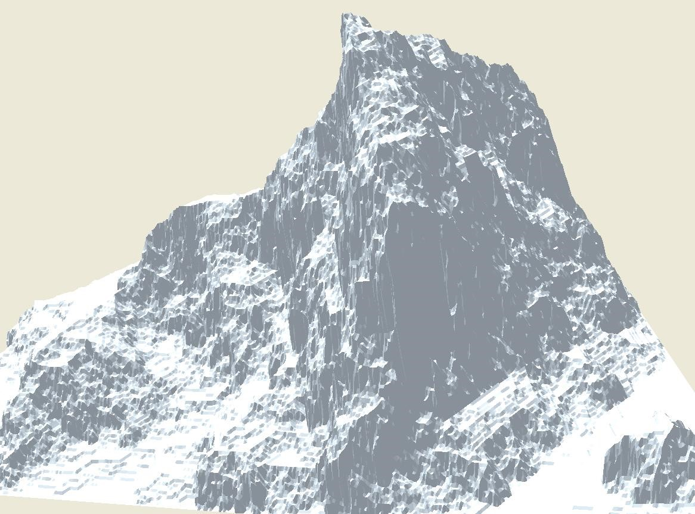

Carnation Rock
==============
A piece of software that random-generates 3D mountain-like surfaces using fractal geometry. The obtained 3D model can be exported to an .obj file.

The executable can be found here http://1drv.ms/1f3QMYK

It's written in Delphi. The project file is for Delphi 2009. This was written in 2009 as a part of a school project. A paper explaining the math behind the code can be found in the link above (in Latvian).

Authors:
Rihards Krišlauks,
Andris Stafeckis,
Aigars Šteinbergs
